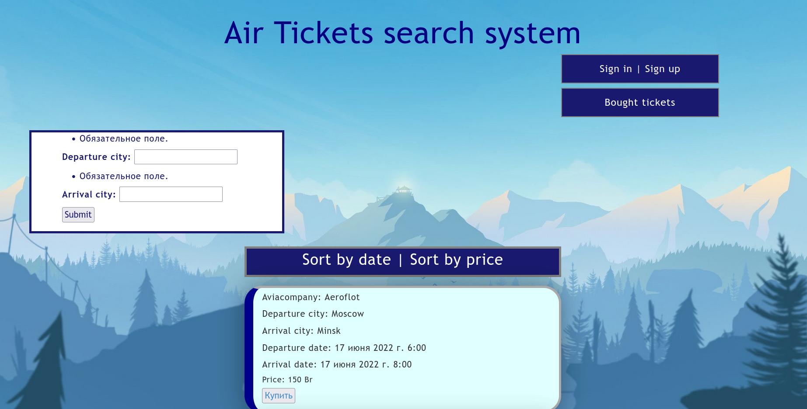
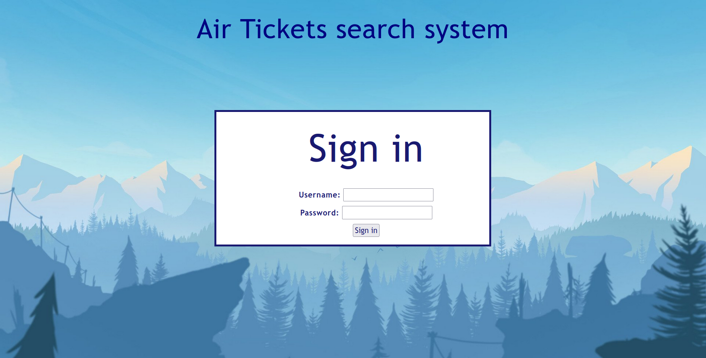
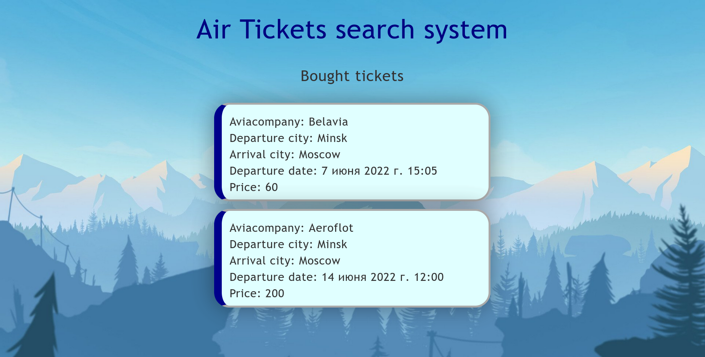
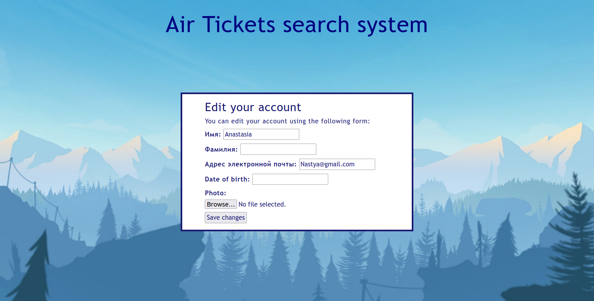
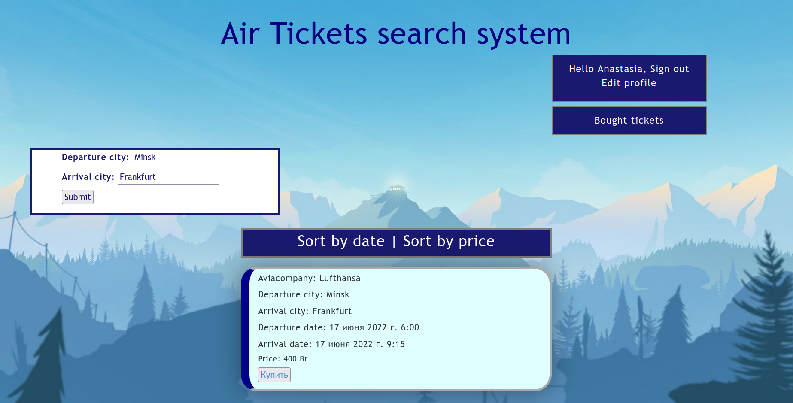
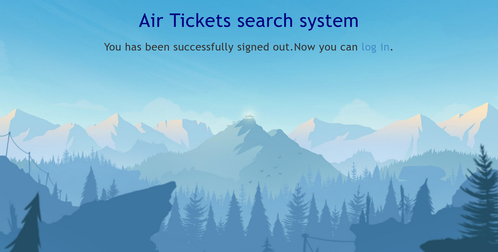
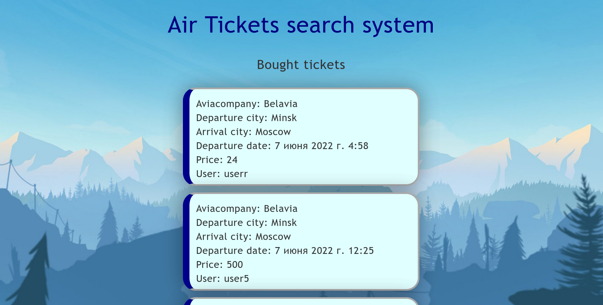

https://airticketssearch.herokuapp.com/
Air Tickets search is a Python web-site to searching and boocking air tickets 

Страница, на которой оказывается неавторизованный пользователь

Рисунок 1. Начальная страница.
Здесь пользователь может сразу начать искать билеты, либо авторизоваться/зарегистрироваться

Рисунок 2. Просмотр забронированных билетов
При попытке посмотреть купленные билеты пользователь не увидит ничего, тк у неавторизованного пользователя не может быть купленных билетов)

Рисунок 3. Страница авторизации

Рисунок 4. После успешной авторизации пользователь видит сообщение что авторизация прошла успешно

Рисунок 5. Главная страница после авторизации. Пользователь получил возвожность редактировать свой профиль, выходить из аккаунта либо просматривать забронированные билеты

Рисунок 6. Просмотр забронированных билетов

Рисунок 7. Страница редактирования профиля

Рисунок 8. Просмотр билетов по выбранных направлениям

Рисунок 9. Сообщение об успешном выходе из аккаунта

Рисунок 10. Страница просмотра забронированных билетов при авторизации админом